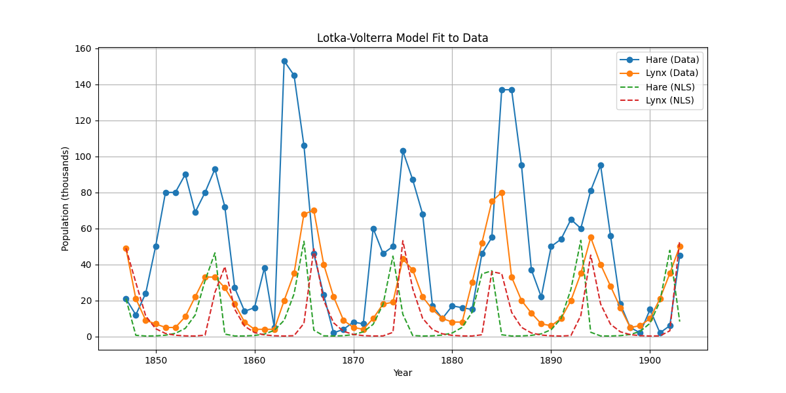
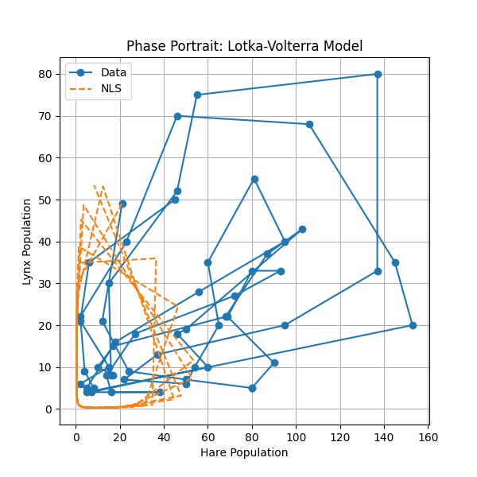

# Lotka-Volterra Parameter Estimation

Estimates parameters of the Lotka-Volterra predator-prey model by fitting to historical hare and lynx population data (1847–1903).

## Background

The Lotka-Volterra equations model the dynamics of two interacting species:

```
dx/dt = α·x − β·x·y   (prey: hare)
dy/dt = δ·x·y − γ·y   (predator: lynx)
```

| Parameter | Description |
|-----------|-------------|
| α | Hare intrinsic growth rate |
| β | Predation coefficient |
| δ | Predator growth efficiency from predation |
| γ | Lynx natural death rate |

## Data

`Leigh1968_harelynx.csv` — 57 years of Canadian hare and lynx fur-trading records (Leigh, 1968). Populations are in thousands of animals.

## How It Works

1. Loads hare/lynx population data from the CSV
2. Numerically solves the ODE system using `scipy.integrate.solve_ivp`
3. Minimizes sum of squared errors between model output and observed data using `scipy.optimize.minimize` (L-BFGS-B)
4. Generates two plots showing the fit quality

## Usage

**Install dependencies:**
```bash
pip install numpy pandas matplotlib scipy
```

**Run:**
```bash
python3 code.py
```

**Output:**
- Console: best-fit parameter values `[α, β, δ, γ]`
- `lotka_volterra_fit.png` — time series of actual vs. fitted populations
- `lotka_volterra_phase_portrait.png` — phase portrait of the predator-prey cycle

## Example Output




## License

MIT License — Copyright (c) 2026 Prisha Priyadarshini
